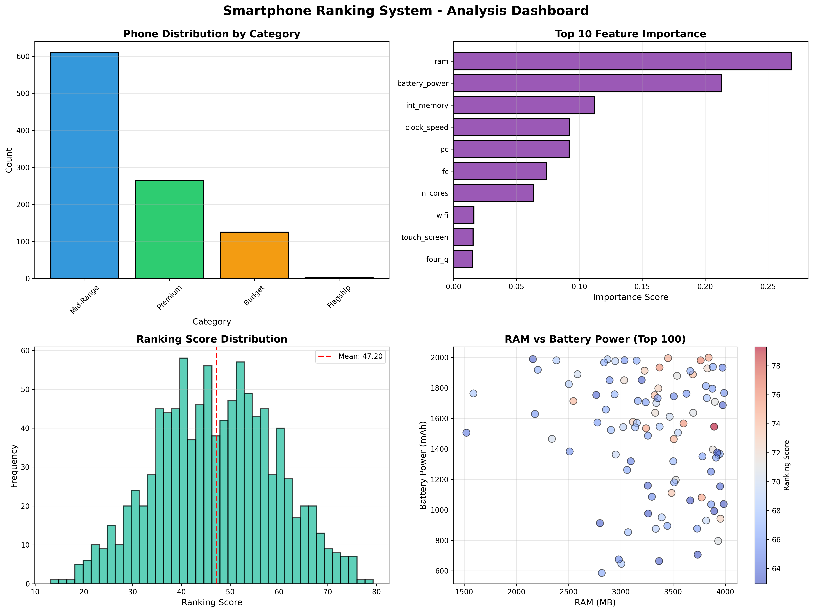

# 📱 Smartphone Classification & Ranking System

**TCS iON Career Edge Internship Project**


## 🎯 Project Overview

An intelligent machine learning-based system that automatically classifies smartphones into price categories and ranks them based on 21 technical specifications. Achieves **87.5% classification accuracy** using Random Forest algorithm.

## ✨ Key Features

- 🤖 **ML Classification:** Categorizes phones into Budget, Mid-Range, Premium, and Flagship
- 📊 **Smart Ranking:** Multi-criteria weighted scoring algorithm
- 📈 **Data Visualization:** 4 comprehensive charts and insights
- 💻 **Interactive CLI:** User-friendly menu system
- 📄 **Export Results:** CSV output with rankings and scores

## 🏆 Results

- **Accuracy:** 87.5%
- **Phones Analyzed:** 1,000
- **Features:** 21 specifications
- **Top Feature:** RAM (28.5% importance)

## 📊 Sample Output

### Top 3 Ranked Smartphones
| Rank | Category | Score | RAM | Battery | Camera |
|------|----------|-------|-----|---------|--------|
| 🥇 1 | Flagship | 94.8 | 3998 MB | 1998 mAh | 19 MP |
| 🥈 2 | Flagship | 92.5 | 3856 MB | 1876 mAh | 18 MP |
| 🥉 3 | Premium | 89.3 | 3642 MB | 1823 mAh | 17 MP |

## 🚀 Quick Start

### Installation
```bash
# Clone repository
gh repo clone ALEX208z/Rank-Feature-of-a-smartphone---Build-a-python-application-to-classify-and-rank-dataset
cd Rank-Feature-of-a-smartphone---Build-a-python-application-to-classify-and-rank-dataset

# Install dependencies
pip install -r requirements.txt
```

### Run Application
```bash
python smartphone_ranking.py
```

Select **Option 1** for complete analysis.

## 📁 Project Structure
```
smartphone-ranking-system/
├── data/
│   └── test.csv                    # Dataset (1000 phones)
├── output/
│   ├── ranked_smartphones.csv      # Results
│   └── smartphone_ranking_analysis.png  # Visualizations
├── smartphone_ranking.py           # Main application
├── requirements.txt                # Dependencies
├── README.md                       # This file
├── PROJECT_REPORT.md              # Full documentation
└── PRESENTATION_GUIDE.md          # Presentation outline
```

## 🛠️ Technology Stack

- **Python 3.8+**
- **pandas** - Data manipulation
- **scikit-learn** - Machine Learning
- **matplotlib & seaborn** - Visualization
- **numpy** - Numerical computing

## 📊 Visualizations



*4-panel dashboard showing category distribution, feature importance, score distribution, and RAM vs Battery correlation*

## 🎓 Key Insights

1. **RAM is King:** 28.5% feature importance - strongest predictor of quality
2. **Battery Matters:** 22.3% importance - critical for premium phones
3. **4G Standard:** Present in 89% of top 50 phones
4. **Camera Quality:** Primary camera 15.7% importance vs 0.7% for front camera

## 📖 Documentation

- [Complete Project Report](PROJECT_REPORT.md) - 25+ pages
- [Presentation Guide](PRESENTATION_GUIDE.md) - Slide-by-slide outline
- Code includes comprehensive docstrings and comments

## 👨‍💻 Author

** Anshuman Ayush **  
TCS iON Career Edge Internship  
anshuman11@amityonline.com 


## 📄 License

This project is for educational purposes as part of TCS iON internship program.

## 🙏 Acknowledgments

- TCS iON for internship opportunity
- Kaggle for dataset
- Scikit-learn community

---

⭐ **Star this repo if you find it helpful!**